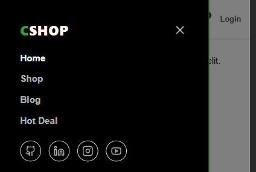
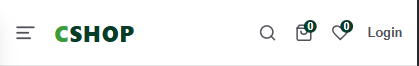

Ini adalah Toko Online yang dibuat dengan NEXT JS

sampai saat ini tahap pengembangan masih pada bagian header section

berikut preview singkat <br />
<h1>desktop</h1> <br />
 <br />
<h1>Mobile</h1> <br />
 <br />
<br />

## Getting Started

1.clone project ini
```bash 
git clone https://github.com/christianLuis07/next-js-Online-Store.git
```
2.install dependency
```bash
npm install
# or
yarn install
```
3. menjalankan project 
```bash
npm run dev
# or
yarn dev
# or
pnpm dev
# or
bun dev
```

