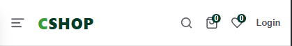
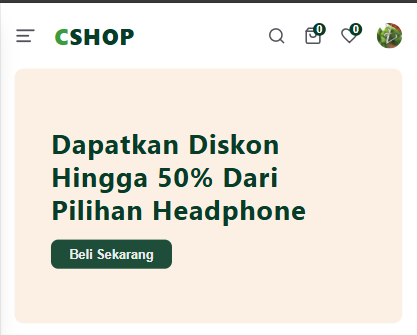

# 🛒 Next.js Online Store

Ini adalah toko online yang dibangun menggunakan **Next.js**.

🚧 **Saat ini proyek masih dalam tahap pengembangan, fokus pada bagian _Home Banner Section_.**

berikut preview singkat <br />
## Desktop


## Mobile (Tablet)


## Mobile (Compact)



## 🚀 Teknologi yang Digunakan
- **Next.js** + **TypeScript**
- **Tailwind CSS**
- **Shadcn/UI**
- **React Icons**

## Getting Started

1.clone project ini
```bash 
git clone https://github.com/christianLuis07/next-js-Online-Store.git
```
2.install dependency
```bash
npm install
# or
yarn install
```
3. menjalankan project 
```bash
npm run dev
# or
yarn dev
# or
pnpm dev
# or
bun dev
```

